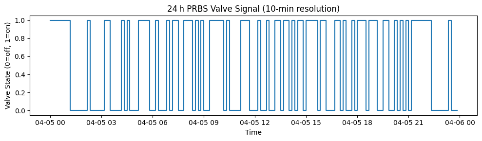
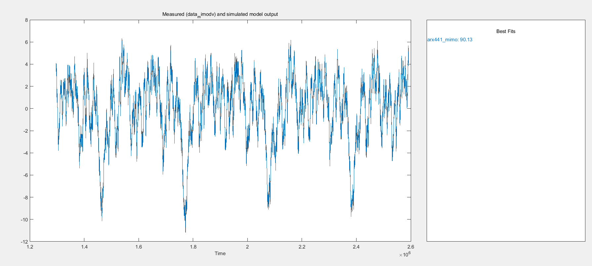
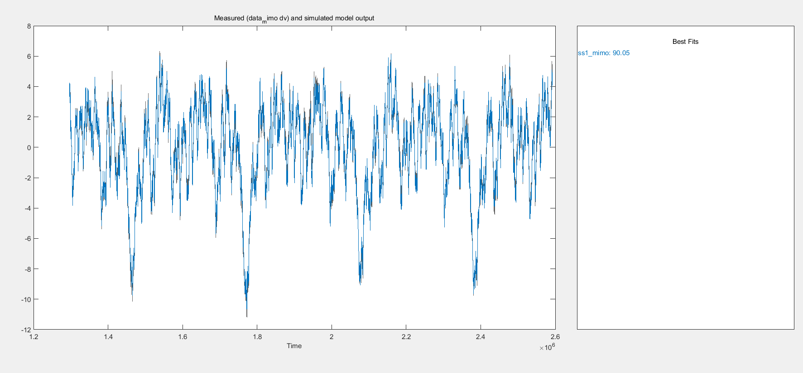
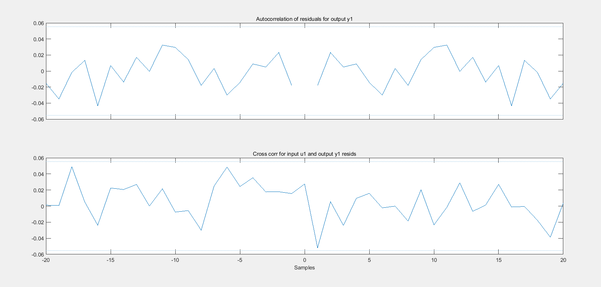
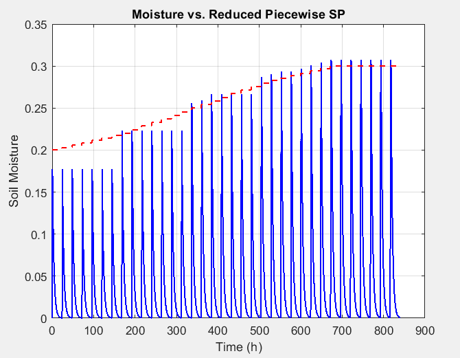
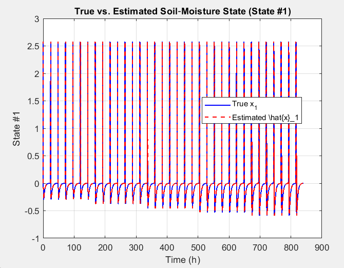
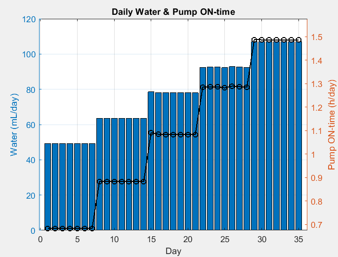
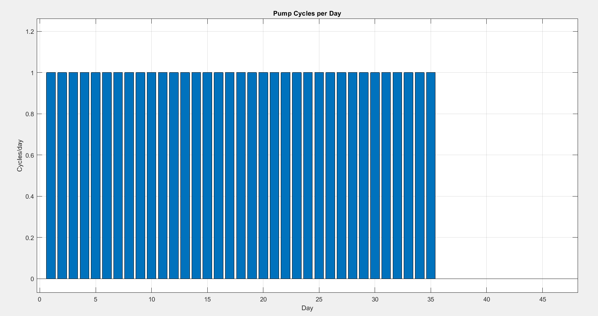
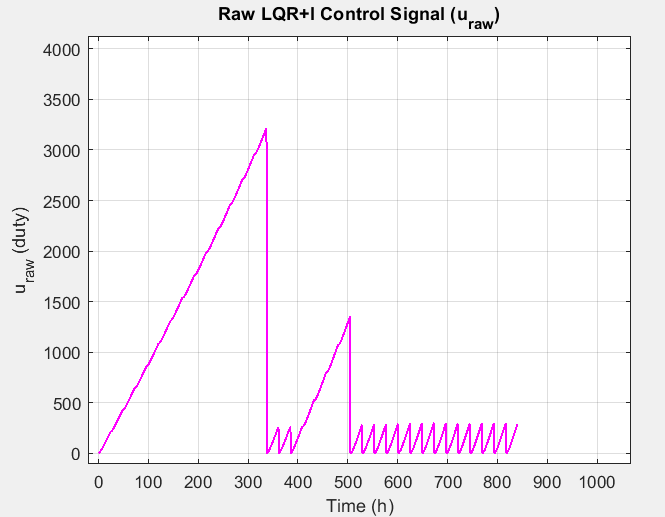

# Advanced Control System Design for Indoor Plant Growth

## Overview

This repository documents a model-based soil-moisture control project for indoor lettuce cultivation. The main contribution is the identification and control workflow: preprocessing sensor data, constructing a persistently excited dataset, comparing candidate models in MATLAB, selecting a state-space model, and evaluating a constrained LQR/Kalman controller.

ESP32-S3 was used as a sensing and communication node for the baseline data collection. The Raspberry Pi/Python work is kept as a prototype layer, while the main technical focus remains MATLAB identification, control design, and simulation.

## Data collection and persistent excitation

Baseline measurements were recorded at 10-minute intervals for soil moisture, irrigation valve state, air temperature, and relative humidity.

An order-9 maximum-length PRBS was used to construct the excitation signal. The binary sequence contains 511 samples before repeating, and a slow chirp was added to broaden the frequency content:

$$
u[k] = u_{\mathrm{PRBS}}[k] + u_{\mathrm{chirp}}[k].
$$

<p align="center">
  
</p>

*Figure 1. Initial 24-hour binary PRBS valve schedule at 10-minute resolution.*

A second-order MISO ARX model fitted from the baseline measurements was driven by the generated excitation:

$$
y[k] = a_1y[k-1] + a_2y[k-2]
     + b_wu[k-1] + b_TT[k-1] + b_HH[k-1] + c + e[k].
$$

The final identification dataset contains **4,320 samples over 30 days** with a sampling interval of **600 seconds**. Temperature and humidity come from the baseline measurements. The signed `water_input` and the resulting `soil_moisture_sim` series were generated computationally; negative excitation values do not represent physical negative irrigation.

## System identification

The processed data were divided chronologically into estimation and validation subsets. Candidate structures included ARX, ARMAX, Output Error, Box-Jenkins, first-order transfer-function, nonlinear Hammerstein-Wiener, and N4SID state-space models.

| Model | Validation fit | FPE | MSE | Role |
|---|---:|---:|---:|---|
| ARX(4,4,1) | 90.13% | 0.009823 | 0.009663 | Lightweight benchmark |
| N4SID, 3 states | 90.08% | 0.009826 | 0.009663 | Selected for control design |
| ARMAX(2,2,1) | 89.53% | 0.01073 | 0.01067 | Explicit noise model |
| P1D | 84.36% | 0.01163 | 0.01151 | First-order comparison |
| NLHW | 79.0% | 0.3631 | 0.3618 | Nonlinear candidate |
| OE(2,2) | 68.15% | 0.9548 | 0.9468 | Output-error candidate |
| BJ(2,2,2,2) | 68.0% | 0.1013 | 0.1002 | Validation degradation |

<p align="center">
  
  
</p>

*Figure 2. ARX(4,4,1) and three-state N4SID validation comparisons. The archived plots report fits of approximately 90%.*

<p align="center">
  
</p>

*Figure 3. Residual autocorrelation and input-residual cross-correlation with confidence bounds.*

ARX achieved the highest reported validation fit. The three-state N4SID model was retained for controller synthesis because it supports LQR feedback and Kalman estimation directly.

The selected realization was reported as

$$
A = \begin{bmatrix}
0 & 0 & -0.0122 \\
1 & 0 & -0.613 \\
0 & 1 & 1.61
\end{bmatrix},\quad
B = \begin{bmatrix}
1 & -12.7 & -1.50 \\
0 & -2.53 & -36.6 \\
0 & 13.3 & 40.8
\end{bmatrix},
$$

$$
C = \begin{bmatrix}0.0185 & 0.0171 & 0.0164\end{bmatrix}.
$$

## LQR with integral action

The discrete plant was augmented with an integral tracking state:

$$
\widetilde{x}[k] = \begin{bmatrix}x[k] \\ w[k]\end{bmatrix},\qquad
\widetilde{A} = \begin{bmatrix}A & 0 \\ -C & 1\end{bmatrix},\qquad
\widetilde{B} = \begin{bmatrix}B \\ 0\end{bmatrix}.
$$

The controller minimizes

$$
J = \sum_{k=0}^{\infty}
\left(\widetilde{x}^{\mathsf T}Q_e\widetilde{x} + u^{\mathsf T}Ru\right)
$$

with

$$
Q_x = \mathrm{diag}(10,1,1),\qquad q_w=0.05,\qquad R=200.
$$

The resulting control law is

$$
u_{\mathrm{raw}}[k] = -K_x\widehat{x}[k] - K_iw[k] + N_br[k].
$$

## Kalman state estimation

A steady-state Kalman filter reconstructs the internal state from the soil-moisture output:

$$
\widehat{x}[k+1] = A\widehat{x}[k] + Bu[k]
+ L\left(y[k]-C\widehat{x}[k]\right),
$$

using

$$
Q_k = 10^{-6}I_3,\qquad R_k = 10^{-4}.
$$

The N4SID states are internal realization coordinates. Soil moisture is represented by the model output $y=Cx$, not by a single state coordinate.

## Constrained irrigation simulation

The 35-day closed-loop simulation combines the controller and estimator with supervisory irrigation logic:

- weekly moisture targets of 20%, 22%, 25%, 28%, and 30%;
- weekly water budgets of 350, 450, 550, 650, and 750 mL;
- actuator saturation to $0 \leq u \leq 1$;
- a $\pm0.5\%$ hysteresis band;
- integrator handling around active constraints;
- pump-duty and daily-volume accounting.

<p align="center">
  
</p>

*Figure 4. Simulated moisture response under the five-week piecewise set-point schedule. Irrigation is applied as daily pulses constrained by the weekly budget.*

<p align="center">
  
</p>

*Figure 5. First internal state coordinate and its steady-state Kalman estimate.*

<p align="center">
  
  
</p>

*Figure 6. Daily simulated water allocation, pump ON time, and one scheduled pump cycle per day.*

<p align="center">
  
</p>

*Figure 7. Unconstrained LQR-integral command before saturation and budget logic.*

The historical run reported an integral absolute error of approximately $6.45\times10^5$ moisture*s and total simulated water use of approximately 2.73 L. These values are simulation outputs and depend on the pump-flow conversion used by the historical model.

## Hardware prototype

Hardware details live in [hardware/README.md](hardware/README.md). The experimental platform used ESP32-S3 sensing/communication, a Raspberry Pi prototype, a capacitive soil-moisture probe, temperature/humidity sensing, and relay-driven irrigation. Hardware is supporting evidence; the main emphasis stays on preprocessing, identification, model selection, controller design, and simulation.

## Repository contents

```text
data/processed/                  Identification datasets
python/data_generation/          PRBS/chirp and MISO-ARX data generation
matlab/01_preprocessing/         Data preparation and chronological split
matlab/02_system_identification/ Candidate-model comparison and diagnostics
matlab/03_control_design/        Control-design documentation
matlab/04_simulation/            Constrained LQR/Kalman simulation
results/models/                  MATLAB model artifacts
results/figures/                 Project and result figures
docs/                            Methodology and technical limitations
hardware/                        Hardware scope and prototype notes
```

## Conclusions

- Persistent excitation made model comparison reproducible.
- ARX and three-state N4SID reached about 90% validation fit on the generated dataset.
- N4SID provided a state-space model suitable for LQR and Kalman design.
- The simulation includes saturation, hysteresis, and water-budget limits.
- Hardware is documented separately and treated as supporting evidence.

## References

1. P. Van Overschee and B. De Moor, *Subspace Identification for Linear Systems*, Kluwer, 1996.
2. L. Ljung, *System Identification: Theory for the User*, 2nd ed., Prentice Hall, 1999.
3. K. Ogata, *Modern Control Engineering*, 5th ed., Prentice Hall, 2010.
4. E. J. van Henten, "Validation of a dynamic lettuce growth model for greenhouse climate control", *Agricultural Systems*, 45, 55-72, 1994.
