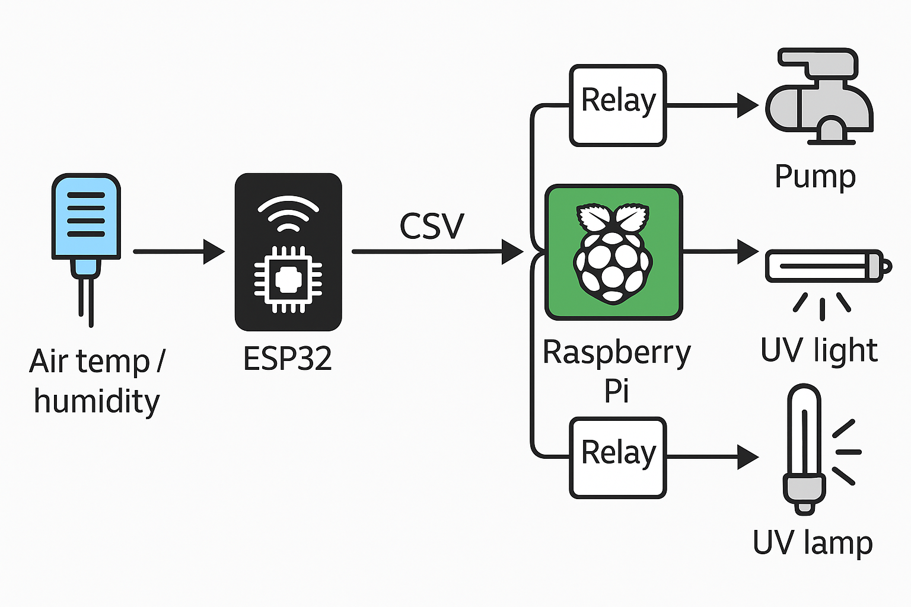
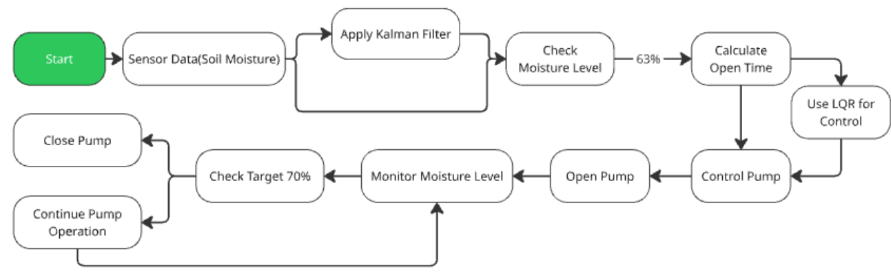
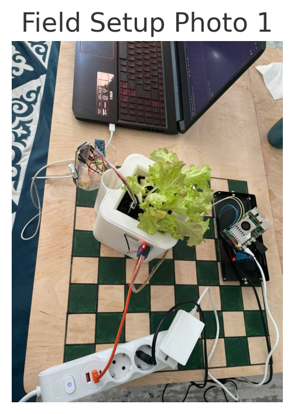
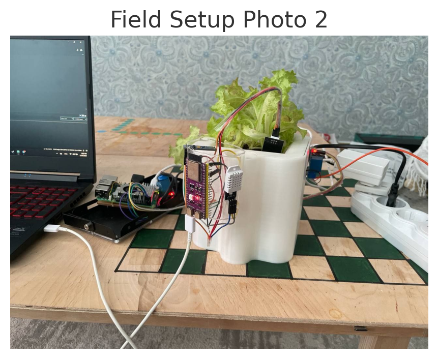

# Hardware Prototype

This folder documents the supporting hardware layer used for data collection and Raspberry Pi prototyping. It is not the main contribution of the project.

The hardware stack combined:

- ESP32-S3 as a sensing and communication node;
- capacitive soil-moisture sensing;
- air temperature and humidity sensing;
- relay-driven irrigation;
- Raspberry Pi 5 for the translated Python control prototype.

The hardware evidence in the public repository is limited to the material that supports the model-based control story. Raw private logs, credentials, Wi-Fi details, and unpublished operational records are not included.

## Included Figures

*Figure 8. Conceptual data and actuation path used for the hardware prototype.*

*Figure 9. Early hardware-control flowchart. This is a prototype-stage diagram, not the final simulation schedule.*

  
  

*Figure 10. Indoor lettuce setup with sensing electronics, Raspberry Pi, relay, and irrigation hardware.*

The Python control-loop screenshots and log snapshots were removed from the main public narrative to keep the repository focused on the reproducible modeling and control work.

